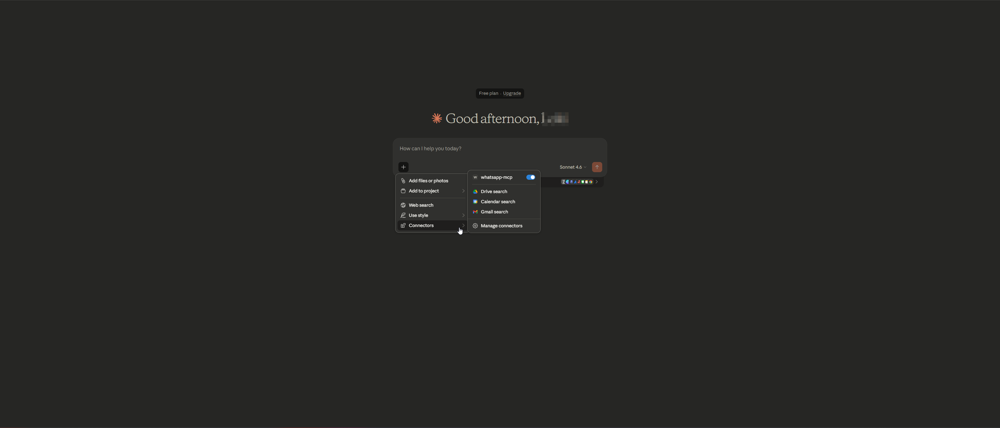
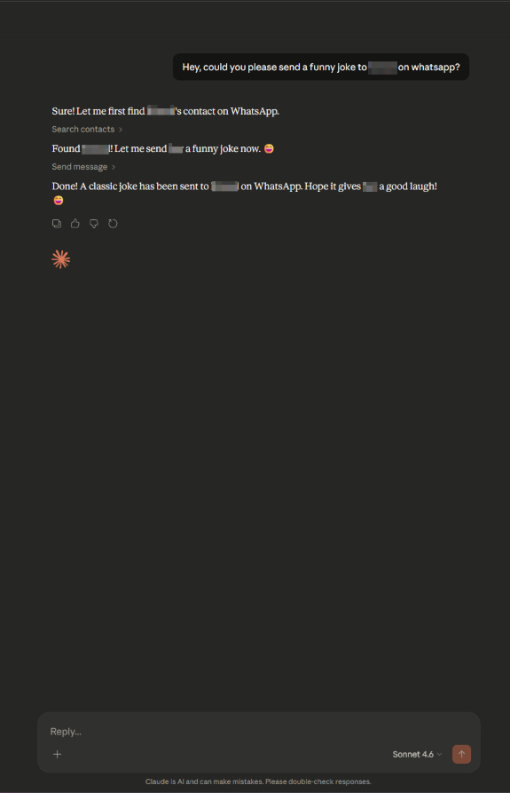

# WhatsApp‑MCP (Go Edition)

A lightweight, WhatsApp MCP server and bridge — rewritten entirely in Go for simplicity, portability, and real‑world automation workflows.

This project is a re‑imagining of the original **[whatsapp-mcp](https://github.com/lharries/whatsapp-mcp)** by **lharries**, who created the first WhatsApp MCP bridge using a Python MCP server and a Go WhatsApp client powered by **WhatsMeow**. Their work demonstrated how Claude Desktop could interact with WhatsApp through the MCP protocol, and this project would not exist without that foundation.

Start `whatsapp-bridge` -> then run `whatsapp-mcp-server` in your preferred mode (STDIO or SSE).

| Connector | Chat |
|------------|----------|
|  |  |

## Installation

### Prerequisites

- Go
- Anthropic Claude Desktop app (or Cursor) or `n8n` workflow
- FFmpeg (_optional_) - Only needed for audio messages. If you want to send audio files as playable WhatsApp voice messages, they must be in `.ogg` Opus format. With FFmpeg installed, the MCP server will automatically convert non-Opus audio files. Without FFmpeg, you can still send raw audio files using the `send_file` tool.

### Steps
1. **Clone this repository**

   ```bash
   git clone https://github.com/iamatulsingh/whatsapp-mcp.git
   cd whatsapp-mcp
   ```

2. **Run the WhatsApp bridge**
   Navigate to the whatsapp-bridge directory and run the Go application:

   ```bash
   cd whatsapp-bridge
   go run main.go
   ```

   The first time you run it, you will be prompted to scan a QR code. Scan the QR code with your WhatsApp mobile app to authenticate.
   After approximately 20 days, you will might need to re-authenticate.

3. **Connect to the MCP server**
    ```bash
    cd whatsapp-mcp-server
    go build -o whatsapp-mcp
    ```
   Copy the below json with the appropriate {{PATH}} values:
   ```json
   {
        "mcpServers": {
            "whatsapp-mcp": {
            "command": "{{PROJECT_BASE_PATH}}/whatsapp-mcp-server/whatsapp-mcp"
            }
        },
        "preferences": {
            "sidebarMode": "chat",
            "coworkScheduledTasksEnabled": false
        }
    }
   ```

   For **Claude**, save this as `claude_desktop_config.json` in your Claude Desktop configuration directory at:

   ```
   ~/Library/Application Support/Claude/claude_desktop_config.json
   ```

   For **Cursor**, save this as `mcp.json` in your Cursor configuration directory at:

   ```
   ~/.cursor/mcp.json
   ```

### Windows Compatibility

If you're running this project on Windows, be aware that `go-sqlite3` requires **CGO to be enabled** in order to compile and work properly. By default, **CGO is disabled on Windows**, so you need to explicitly enable it and have a C compiler installed.

#### Steps to get it working:

1. **Install a C compiler**  
   We recommend using [MSYS2](https://www.msys2.org/) to install a C compiler for Windows. After installing MSYS2, make sure to add the `ucrt64\bin` folder to your `PATH`.  
   → A step-by-step guide is available [here](https://code.visualstudio.com/docs/cpp/config-mingw).

2. **Enable CGO and run the app**

   ```bash
   cd whatsapp-bridge
   go env -w CGO_ENABLED=1
   go run main.go
   ```

OR

Simply use dokcer compose to do all the job for you
```bash
docker compose up
```


## Architecture Overview

This application consists of two main components:

1. **WhatsApp Bridge** (`whatsapp-bridge/`): A Go application that connects to WhatsApp's web API, handles authentication via QR code, and stores message history in SQLite. It serves as the bridge between WhatsApp and the MCP server.

2. **MCP Server** (`whatsapp-mcp-server/`): A Go implemention of the Model Context Protocol (MCP), which provides standardized tools for Claude to interact with WhatsApp data and send/receive messages.

### Data Storage

- All message history is stored in `postgres` by default and you'll need to create a database name `whatsapp` OR a SQLite database within the `whatsapp-bridge/store/` directory
- The database maintains tables for chats and messages
- Messages are indexed for efficient searching and retrieval

### MCP Tools

Claude can access the following tools to interact with WhatsApp:

- **search_contacts**: Search for contacts by name or phone number
- **list_messages**: Retrieve messages with optional filters and context
- **list_chats**: List available chats with metadata
- **get_chat**: Get information about a specific chat
- **get_direct_chat_by_contact**: Find a direct chat with a specific contact
- **get_contact_chats**: List all chats involving a specific contact
- **get_last_interaction**: Get the most recent message with a contact
- **get_message_context**: Retrieve context around a specific message
- **send_message**: Send a WhatsApp message to a specified phone number or group JID
- **send_file**: Send a file (image, video, raw audio, document) to a specified recipient
- **send_audio_message**: Send an audio file as a WhatsApp voice message (requires the file to be an .ogg opus file or ffmpeg must be installed)
- **download_media**: Download media from a WhatsApp message and get the local file path

### Media Handling Features

The MCP server supports both sending and receiving various media types:

#### Media Sending

You can send various media types to your WhatsApp contacts:

- **Images, Videos, Documents**: Use the `send_file` tool to share any supported media type.
- **Voice Messages**: Use the `send_audio_message` tool to send audio files as playable WhatsApp voice messages.
  - For optimal compatibility, audio files should be in `.ogg` Opus format.
  - With FFmpeg installed, the system will automatically convert other audio formats (MP3, WAV, etc.) to the required format.
  - Without FFmpeg, you can still send raw audio files using the `send_file` tool, but they won't appear as playable voice messages.

#### Media Downloading

By default, just the metadata of the media is stored in the local database. The message will indicate that media was sent. To access this media you need to use the download_media tool which takes the `message_id` and `chat_jid` (which are shown when printing messages containing the meda), this downloads the media and then returns the file path which can be then opened or passed to another tool.


## Technical Details

1. Claude sends requests to the MCP server
2. The MCP server queries the Go bridge for WhatsApp data or directly to the SQLite database
3. The Bridge accesses the WhatsApp API and keeps the SQLite or Postgres database up to date
4. Data flows back through the chain to Claude
5. When sending messages, the request flows from Claude through the MCP server to the bridge and to WhatsApp

## Troubleshooting

- Make sure both the Bridge application and the MCP server are running for the integration to work properly.
- In case of the Client outdated (405) error in the Bridge Go server,
    ```bash
    06:13:28.434 [Client INFO] Starting WhatsApp client...
    2025/07/29 06:13:28 Connecting to postgres
    06:13:30.402 [Client ERROR] Client outdated (405) connect failure (client version: 2.3000.1021018791)
    06:13:30.403 [Client/Socket ERROR] Error reading from websocket: websocket: close 1006 (abnormal closure): unexpecte
    06:13:30.675 [Client ERROR] Failed to establish stable connection
    ```

    Run below command and fix any error in your code after upgrade and the bridge code will automatic update the whatsapp client version.
    
    ```bash
    go get -u go.mau.fi/whatsmeow@latest
    ```
    
    OR Update all packages
    
    ```bash
    go get -u
    ```

### Authentication Issues

- **QR Code Not Displaying**: If the QR code doesn't appear, try restarting the authentication script. If issues persist, check if your terminal supports displaying QR codes.
- **WhatsApp Already Logged In**: If your session is already active, the Go bridge will automatically reconnect without showing a QR code.
- **Device Limit Reached**: WhatsApp limits the number of linked devices. If you reach this limit, you'll need to remove an existing device from WhatsApp on your phone (Settings > Linked Devices).
- **No Messages Loading**: After initial authentication, it can take several minutes for your message history to load, especially if you have many chats.
- **WhatsApp Out of Sync**: If your WhatsApp messages get out of sync with the bridge, delete both database files (`whatsapp-bridge/store/messages.db` and `whatsapp-bridge/store/whatsapp.db`) and restart the bridge to re-authenticate.

This fork takes the core idea and rebuilds it with a different philosophy:  
**one language, one binary, clean architecture, and flexible deployment.**

---

## Why This Project Exists

The original project is excellent, but it was designed specifically for **Claude Desktop**, and its architecture had a few constraints that made extending or deploying it more difficult. This fork was created to solve those pain points.

* ***Single Language: Everything in Go**
The original design split responsibilities: This dramatically simplifies development and distribution.

* **Clean Architecture: No Mixed Database Logic** 
Moving all database logic into the bridge

* **SQLite or PostgreSQL — Your Choice**
The original project only supported SQLite.

* **Two Communication Modes: STDIO + SSE** The original project was built only for Claude Desktop (STDIO MCP). This makes the project usable far beyond Claude Desktop.

* **Docker Support** This makes deployment trivial on:
- servers  
- containers  
- orchestrators  
- local development  

---

## Features

- Full WhatsApp client using **WhatsMeow**
- Pure Go MCP server
- Clean API boundary between MCP and bridge
- SQLite or PostgreSQL support
- STDIO + SSE modes
- Lightweight Docker image
- Easy deployment with Docker Compose
- No Python dependencies
- No mixed database logic
- Production‑ready architecture

---

## Credits

This project stands on the shoulders of two major contributors:

### **Original Author: lharries**
The initial idea, architecture, and implementation of WhatsApp‑MCP came from  
**https://github.com/lharries/whatsapp-mcp**

Their work demonstrated how MCP could be used to bridge WhatsApp and Claude Desktop.  
This fork would not exist without their project.

### **WhatsMeow**
The WhatsApp client functionality is powered by the incredible Go library:  
**https://github.com/tulir/whatsmeow**

Without WhatsMeow, none of this would be possible.

---

## Why You Might Use This Fork

Choose this version if you want:

- a cleaner architecture  
- a single‑language codebase  
- a portable binary  
- Docker support  
- PostgreSQL support  
- SSE support for automation workflows  
- a more maintainable and extensible project  

The goal is not to replace the original project but to offer an alternative that fits different needs — especially for developers who prefer Go or want to deploy MCP‑based WhatsApp automation in production environments.

